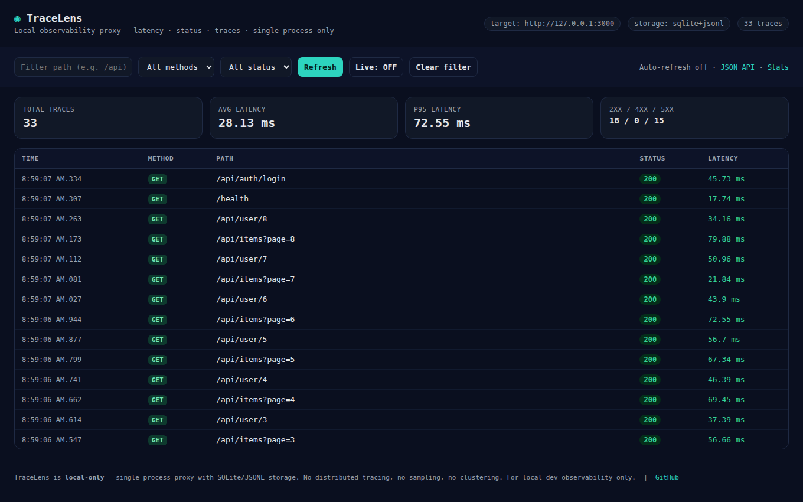

# TraceLens

Local observability proxy and passive security inspector that captures HTTP latency, status, headers, and security issues to SQLite/JSONL. Single-process, local-only.

## Scope

TraceLens is a developer proxy for single-machine API monitoring and passive traffic security inspection. It records request traces, measures latency, and flags security issues like unencrypted cookies, missing security headers, or leaked API tokens in URLs.



## What It Does

- Proxies any HTTP target (`TARGET=http://localhost:3000`) on `http://localhost:3888`
- Records per-request: method, path, status, latency (ms), timestamp, target, headers, error
- **Passive Security Inspector**: automatically detects missing CSP/MIME headers, insecure cookies, and credential leaks in query params
- Stores to `data/traces.jsonl` (always) and `data/traces.db` via `node:sqlite` when available (Node >=22.5)
- Serves a minimal viewer and JSON API at `/__tracelens`

## Quick Start

```bash
npm install
TARGET=http://localhost:3000 npm start
# or
PORT=3888 TARGET=http://localhost:3000 node src/proxy.mjs
```

Send traffic through the proxy:

```bash
curl http://localhost:3888/api/hello
```

Open viewer and security findings:
- Viewer: http://localhost:3888/__tracelens
- Security Report: http://localhost:3888/__tracelens/security

## API Endpoints

| Endpoint | Description |
|---|---|
| `GET /__tracelens` | Viewer HTML |
| `GET /__tracelens/traces` | JSON traces list |
| `GET /__tracelens/security` | Passive traffic security findings |
| `GET /__tracelens/stats` | Count, avg/p95 latency, security findings count |
| `GET /__tracelens/health` | Health check |

## License

[MIT License](LICENSE)
